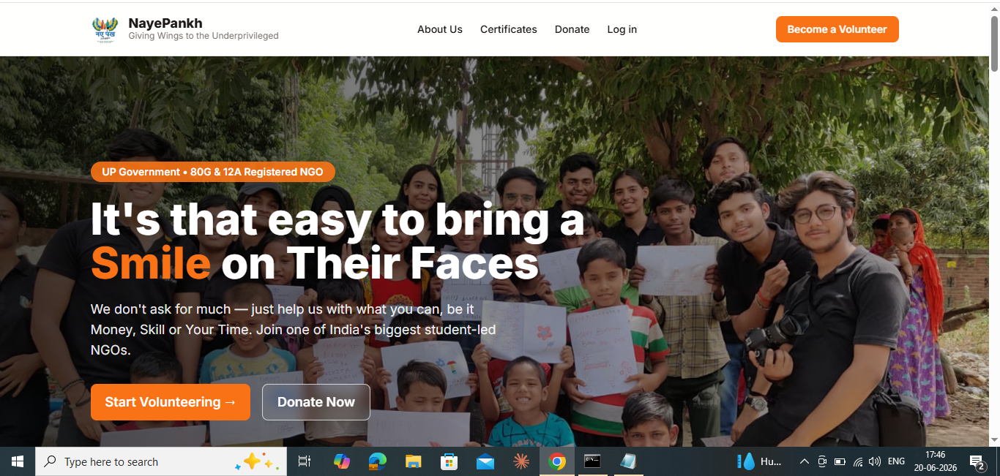
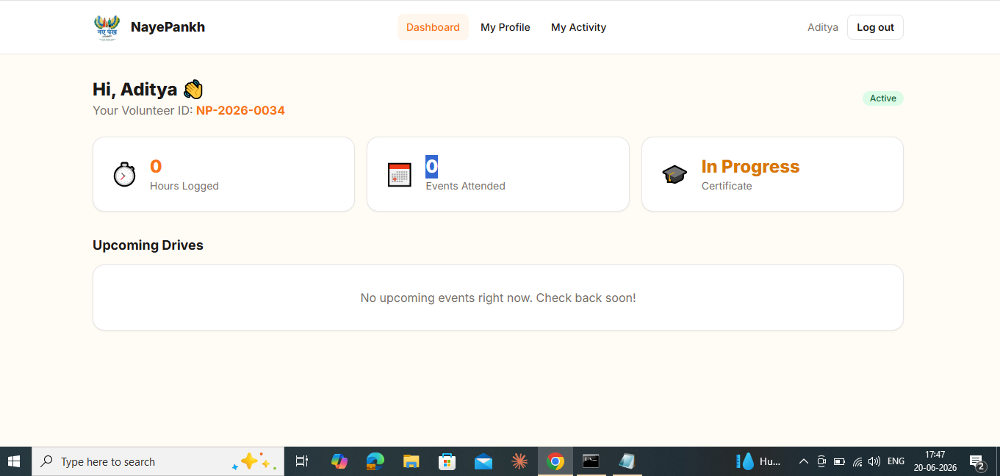
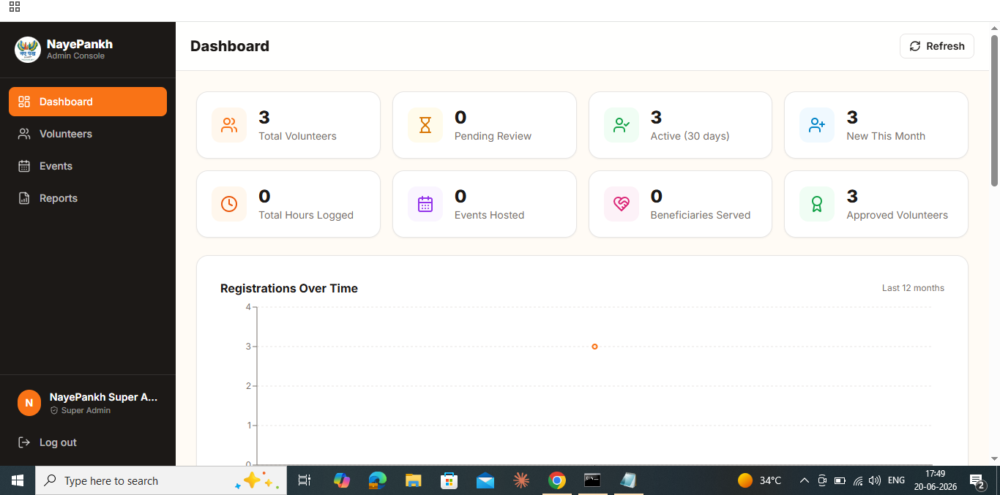

# NayePankh Volunteer Management System

A full-stack volunteer registration and management platform built for **NayePankh Foundation**.  
It supports volunteer onboarding, email verification, login/logout with token refresh, profile management, event registration, attendance tracking, admin approvals, report generation, and certificate issuance.

---

## ✨ Key Features

### Public / Volunteer Flow
- Volunteer registration with detailed profile form
- Email verification link
- Login, logout, forgot password, and reset password
- Session restoration using refresh token cookie
- Volunteer dashboard with status, hours logged, and upcoming drives
- Profile management and activity history
- Event browsing, registration, and cancellation

### Admin / Coordinator Flow
- Admin login and protected admin dashboard
- Volunteer approval / rejection workflow
- City-scoped coordinator access
- Volunteer management with filters and search
- Event creation, editing, cancellation, and reminders
- Attendance marking for events
- Broadcast email to volunteers
- Dashboard analytics with charts and trends
- Reports export in CSV and PDF
- Certificate generation for eligible volunteers
- Audit logs for sensitive administrative actions

### Platform / Security
- JWT-based authentication with access + refresh tokens
- HTTP-only refresh cookie
- Role-based authorization
- Rate limiting on API routes
- Cloudinary image uploads
- MongoDB data storage
- PDF and CSV generation for reports
- Logging with Winston

---

## 🛠 Tech Stack

| Layer | Technology |
|---|---|
| Frontend | React, Vite |
| Styling | Tailwind CSS |
| State Management | Zustand |
| Forms | React Hook Form, Zod |
| Charts | Recharts |
| Notifications | React Hot Toast |
| Backend | Node.js, Express.js |
| Database | MongoDB, Mongoose |
| Authentication | JWT, HTTP-only cookies |
| Email | Nodemailer |
| File Uploads | Multer, Cloudinary |
| Reports | PDFKit, csv-writer |
| Logging | Winston |
| Security | CORS, express-rate-limit |

---

## 📁 Project Structure

```text
client/
  src/
    components/
    constants/
    hooks/
    pages/
    services/
    store/
    utils/
  public/
  vite.config.js
  tailwind.config.js

server/
  config/
  controllers/
  middleware/
  models/
  routes/
  utils/
  logs/
  server.js
```

---

## 🚀 Main Modules

### Frontend
- **Home page** with foundation branding and call-to-action
- **Volunteer pages** for dashboard, profile, and activity
- **Admin pages** for dashboard, volunteer management, event management, and reports
- **Authentication pages** for login, registration, email verification, and password reset

### Backend
- **Auth API** for registration, login, refresh, logout, verification, and password reset
- **Volunteer API** for profile access and admin actions
- **Event API** for managing drives and registrations
- **Admin API** for stats, pending approvals, broadcast email, and logs
- **Report API** for CSV/PDF exports and saved reports

---

## 🔐 Authentication Flow

1. User registers as a volunteer.
2. An email verification link is sent.
3. After verification, the user can log in.
4. The server issues:
   - an **access token**
   - a **refresh token** stored in an **HTTP-only cookie**
5. The frontend automatically restores the session on refresh using `/api/auth/refresh`.
6. Protected routes are guarded by role checks.

---

## 👥 Roles

The system supports these roles:

- `volunteer`
- `city_coordinator`
- `admin`
- `super_admin`

### Role Behavior
- **Volunteer**: can manage own profile, view events, register for drives, and see personal activity
- **City Coordinator**: can manage volunteers and events for the assigned city
- **Admin**: can manage volunteers, events, attendance, reports, and broadcast emails
- **Super Admin**: has highest access, including logs and deletion actions

---

## 📡 API Overview

### Auth
| Method | Endpoint | Description |
|---|---|---|
| POST | `/api/auth/register` | Register a volunteer |
| POST | `/api/auth/login` | Login |
| POST | `/api/auth/logout` | Logout |
| GET | `/api/auth/verify-email/:token` | Verify email |
| POST | `/api/auth/resend-verification` | Resend verification email |
| POST | `/api/auth/forgot-password` | Send password reset link |
| POST | `/api/auth/reset-password/:token` | Reset password |
| POST | `/api/auth/refresh` | Refresh access token |
| GET | `/api/auth/me` | Get current user and volunteer profile |
| PUT | `/api/auth/change-password` | Change password |

### Volunteers
| Method | Endpoint | Description |
|---|---|---|
| GET | `/api/volunteers` | List volunteers with filters |
| GET | `/api/volunteers/:id` | Get one volunteer |
| PUT | `/api/volunteers/:id` | Update volunteer profile |
| PUT | `/api/volunteers/:id/status` | Change volunteer status |
| PUT | `/api/volunteers/:id/assign-coordinator` | Assign coordinator |
| PUT | `/api/volunteers/:id/notes` | Update admin notes |
| PUT | `/api/volunteers/:id/photo` | Upload/update photo |
| GET | `/api/volunteers/:id/activity` | Get activity history |
| POST | `/api/volunteers/:id/generate-certificate` | Generate certificate |
| POST | `/api/volunteers/bulk-approve` | Bulk approve volunteers |
| DELETE | `/api/volunteers/:id` | Delete volunteer |

### Events
| Method | Endpoint | Description |
|---|---|---|
| GET | `/api/events` | List events with filters |
| GET | `/api/events/:id` | Get event details |
| POST | `/api/events` | Create event |
| PUT | `/api/events/:id` | Update event |
| DELETE | `/api/events/:id` | Cancel event |
| POST | `/api/events/:id/register` | Register volunteer for event |
| DELETE | `/api/events/:id/register` | Cancel event registration |
| GET | `/api/events/:id/volunteers` | List volunteers for event |
| PUT | `/api/events/:id/attendance` | Mark attendance |
| POST | `/api/events/:id/remind` | Send event reminder |

### Admin
| Method | Endpoint | Description |
|---|---|---|
| GET | `/api/admin/stats` | Dashboard metrics |
| GET | `/api/admin/pending` | Pending volunteer approvals |
| GET | `/api/admin/registrations-trend` | Registration trend analytics |
| POST | `/api/admin/send-email` | Broadcast email |
| GET | `/api/admin/logs` | View logs |

### Reports
| Method | Endpoint | Description |
|---|---|---|
| GET | `/api/reports/volunteers` | Report data for volunteers |
| GET | `/api/reports/volunteers/csv` | Export volunteer report as CSV |
| GET | `/api/reports/volunteers/pdf` | Export volunteer report as PDF |
| GET | `/api/reports/city-summary` | City-wise summary |
| GET | `/api/reports/cause-impact` | Cause-wise impact summary |
| GET | `/api/reports/saved` | View saved reports |
| POST | `/api/reports/save` | Save report snapshot |

---

## ⚙️ Environment Variables

### Server `.env`
```env
PORT=5000
NODE_ENV=development
FRONTEND_URL=http://localhost:5173

MONGODB_URI=your_mongodb_connection_string

JWT_ACCESS_SECRET=your_access_secret
JWT_REFRESH_SECRET=your_refresh_secret
JWT_ACCESS_EXPIRY=15m
JWT_REFRESH_EXPIRY=7d

EMAIL_HOST=smtp.gmail.com
EMAIL_PORT=587
EMAIL_USER=your_email
EMAIL_PASS=your_email_app_password
EMAIL_FROM="NayePankh Foundation <your_email>"

CLOUDINARY_CLOUD_NAME=your_cloudinary_name
CLOUDINARY_API_KEY=your_cloudinary_key
CLOUDINARY_API_SECRET=your_cloudinary_secret

SUPER_ADMIN_EMAIL=admin@nayepankh.com
SUPER_ADMIN_PASSWORD=ChangeMe123!
VOLUNTEER_MIN_AGE=14
CERTIFICATE_MIN_HOURS=20
CERTIFICATE_MIN_EVENTS=3
```

### Client `.env`
```env
VITE_API_URL=http://localhost:5000/api
```

---

## 🧪 Local Setup

### 1) Clone the repository
```bash
git clone <your-repository-url>
cd <repository-folder>
```

### 2) Install backend dependencies
```bash
cd server
npm install
```

### 3) Install frontend dependencies
```bash
cd ../client
npm install
```

### 4) Configure environment variables
- Create a `.env` file in `server/`
- Create a `.env` file in `client/`
- Fill them using the examples above

### 5) Run the backend
```bash
cd server
npm run dev
```

### 6) Run the frontend
```bash
cd client
npm run dev
```

---

## 🔑 Seed Super Admin

The backend includes a seed script for creating the initial super admin.

```bash
cd server
npm run seed
```

---

## 🖼 Screenshots

Add screenshots here to make the submission stronger:

```md
### Home Page


### Volunteer Dashboard


### Admin Dashboard

```

---

## 📊 What This Project Demonstrates

This project shows:
- Full-stack development
- Authentication and authorization
- Dashboard and analytics UI
- CRUD operations
- Role-based access control
- Email workflows
- File upload integration
- Report generation
- Real-world deployment readiness

---

## 🔮 Future Improvements

- Mobile app version
- Advanced search and sorting
- Attendance QR check-in
- Event capacity alerts
- Better analytics and export filters
- Multi-language support
- Notification center
- Audit log viewer UI

---

## 📄 License

This project is intended for educational and organizational use.

---

## Acknowledgement

Built for **NayePankh Foundation** volunteer operations and community service workflows.
